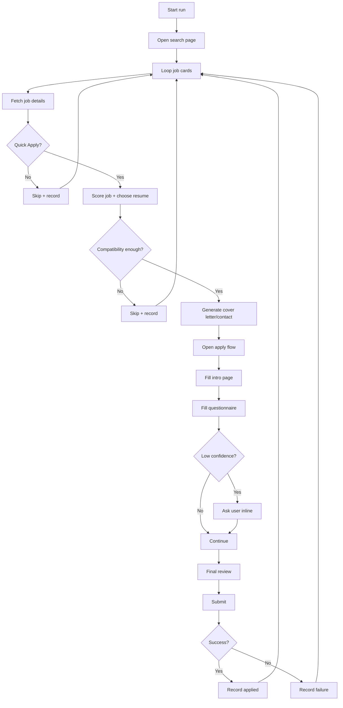
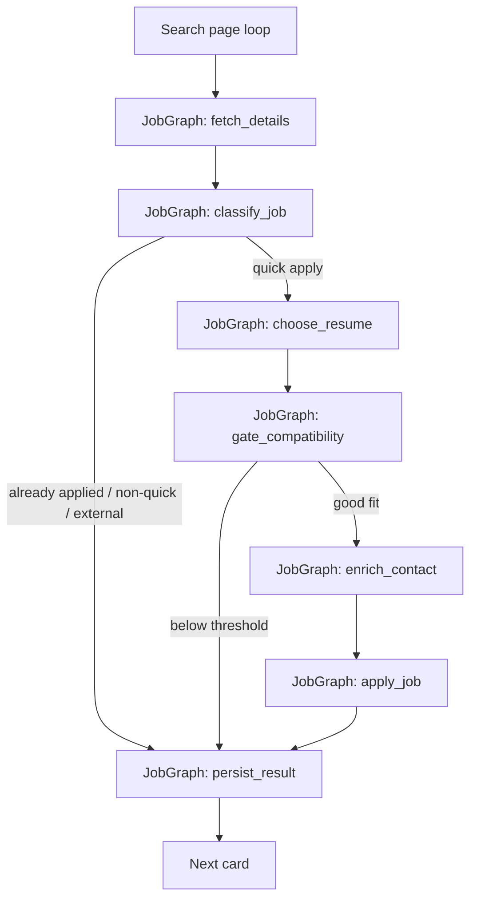

# SeekBot

SeekBot is a local automation tool for **Seek Quick Apply** jobs.

It is built for people who:
- search across multiple related roles
- keep multiple tailored resumes
- want resume selection and cover letters handled automatically
- want employer-question answering to improve over time through LLM support and user-confirmed memory

This project is intentionally local-first. Your browser session, resumes, answers, logs, and memory stay on your machine unless you explicitly point the LLM layer at a hosted provider.

## What It Does

For each configured role search, SeekBot:

1. opens Seek search results
2. visits each job page
3. skips jobs that are not Quick Apply
4. compares the JD against all configured resumes
5. picks the best resume, with a bias toward the current search role unless another resume is materially better
6. handles page 1 assets:
   - resume selection or upload
   - short tailored cover letter
7. fills employer questions using:
   - verified Q&A memory first
   - similar verified Q&A next
   - otherwise the LLM from the resume plus verified prior Q&A context
   - otherwise the user if confidence is too low
8. records the outcome in local persistence, with Postgres as the primary backend

## Current Scope

The current project scope is **Quick Apply only**.

That is not just a v1 limitation. It is the current product boundary. External apply flows and non-Quick Apply flows are out of scope right now.

## Version History

- `v1`
  - initial GitHub publish
  - Quick Apply-only runtime
  - CSV job index and local Q&A memory
- `v1.5`
  - internal package cleanup: `llm/`, `storage/`, `domain.py`
  - structured LLM outputs with schemas
  - hybrid semantic resume matching
  - search `location` support
- `v2`
  - local Postgres + `pgvector` for jobs and Q&A memory
  - semantic verified-memory retrieval for employer questions
  - questionnaire flow changed to memory-first, with resume-only LLM answering
  - Hugging Face added as a first-class hosted provider
  - API-backed cover letters, contact extraction, and structured questionnaire answers
  - per-job LangGraph orchestration for explicit fetch/classify/score/apply/persist transitions

## Design Overview

SeekBot is split into a few clear layers:

- `seekbot/seek/`: browser automation and Seek-specific page handling
- `seekbot/matching.py`: semantic JD-led resume matching with keyword explanations
- `seekbot/llm/`: prompt construction, structured response handling, schemas, and provider adapters
- `seekbot/storage/`: reusable employer-question memory and deduplicated job result index
- `seekbot/job_graph.py`: explicit LangGraph state machine for per-job orchestration
- local Postgres is now the primary storage backend for job outcomes and Q&A memory
- CSV persistence remains only as a fallback/bootstrap path when Postgres is not configured or unavailable
- `seekbot/domain.py`: shared workflow data structures
- `seekbot/config/`: internal defaults and matching taxonomy
- `seek_config.py` / `seek_config_local.py`: user-editable config

### Why Playwright

The project previously struggled with Selenium flakiness around dynamic form controls, retries, and navigation. The current browser layer uses Playwright because it is better suited to modern dynamic forms and makes state-driven page interactions simpler.

### Why Matching Uses Hybrid Semantic Scoring

Resume selection is intentionally **not** LLM-scored at runtime.

The current matcher:
- uses `sentence-transformers` locally for resume/JD embedding similarity
- caches resume embeddings at startup
- computes JD similarity per job
- keeps taxonomy keyword extraction for explanation and logs

That choice gives you:
- semantic retrieval instead of pure lexical overlap
- no API key requirement for matching
- more robust resume choice across role wording differences
- still-readable matched/missing keyword logs for debugging

### Why Employer Questions Use an LLM

Employer questions are less uniform than job descriptions. Option labels and free-text questions vary a lot across employers, so SeekBot uses an LLM for questionnaire answers. The questionnaire prompt uses the resume plus verified prior Q&A memory, not the JD.

The v2 LLM layer now uses:
- Pydantic response models
- `instructor` for schema-constrained generation
- provider adapters for Ollama, Hugging Face, OpenAI, and Anthropic

The current questionnaire flow is:

1. exact verified memory match
2. similar verified memory candidate
3. otherwise ask the LLM from the resume plus verified prior Q&A context
4. if `confidence <= 0.85`, ask the user
5. store the applied answer in Q&A memory, but only verified answers are reused or shown back to the model as trusted context

The job description is intentionally not part of questionnaire answering anymore. It stays available for matching, contact extraction, and cover letters, but not for candidate-fact questions.

This creates a simple self-improving loop:
- the LLM is the guesser
- the user is the teacher
- the local memory becomes the reusable answer store

### Why LangGraph

The older runtime handled each job through one long imperative chain inside `workflow.py`. It worked, but the actual states were implicit.

The current V2 runtime keeps the outer search-page loop simple, but each individual job now moves through an explicit LangGraph state machine:
- fetch details
- classify quick apply / skip
- choose resume
- gate by compatibility
- enrich contact
- apply
- persist result

That makes the job lifecycle easier to reason about, easier to extend with retries or human checkpoints later, and easier to log as real state transitions instead of scattered branching.

### Flow Before And After

Before:



After:



## Repository Layout

```text
seekbot/
  __main__.py
  cli.py
  workflow.py
  job_graph.py
  settings.py
  logging_utils.py
  domain.py
  resume_parser.py
  matching.py
  llm/
    __init__.py
    service.py
    providers.py
    schemas.py
  storage/
    __init__.py
    db.py
    jobs.py
    question_memory.py
    schema.sql
  config/
    __init__.py
    internal.py
    matching.py
  seek/
    __init__.py
    browser.py
    search.py
    forms.py
    application.py
scripts/
  debug_llm_question.py
  eval_report.py
seek_config.py
seek_config_local.py
SeekBot.py
```

## Requirements

- Python 3.11+
- Google Chrome or Chromium for Playwright
- a Seek account
- at least one resume in `.docx`, `.pdf`, or text-compatible format
- local Postgres with `pgvector` for the primary storage path
- one supported LLM provider:
  - local Ollama via `ollama`
  - Hugging Face via `huggingface`
  - OpenAI
  - Anthropic

## Installation

Install dependencies:

```bash
pip install -r requirements.txt
python -m playwright install chrome
```

## Configuration

Create your local private config:

```bash
cp seek_config.py seek_config_local.py
```

Edit `seek_config_local.py`:

- `defaults.role_resumes`
  - map each search role to a resume path
- `defaults.location`
  - optional search location added to generated Seek search URLs
- `storage`
  - Postgres backend settings
  - either set `storage.dsn` or export `SEEKBOT_POSTGRES_DSN`
  - `bootstrap_from_csv = True` imports legacy CSV data into empty Postgres tables on first use
- `llm`
  - provider, model, URL, API env vars, and signature name
  - for Hugging Face, set `api_key_env` to `HF_TOKEN`

`seek_config.py` is the public template.  
`seek_config_local.py` is your private local file and is ignored by git.

The loader uses:

1. `seek_config_local`
2. `seek_config`

## Postgres Setup

Minimal local setup:

1. create a local database, for example `seekbot`
2. enable `pgvector`
3. set a DSN with either:
   - `storage.dsn` in `seek_config_local.py`
   - or `SEEKBOT_POSTGRES_DSN` in your shell

Example:

```bash
export SEEKBOT_POSTGRES_DSN='postgresql://USER@127.0.0.1:5432/seekbot'
```

SeekBot creates the schema automatically on startup from [schema.sql](seekbot/storage/schema.sql).

If you want a truly clean Postgres state for testing, set:

```python
"storage": {
    "backend": "postgres",
    "bootstrap_from_csv": False,
}
```

That disables the legacy CSV bootstrap import.

## Running The Bot

Typical run:

```bash
python SeekBot.py
```

or:

```bash
python -m seekbot
```

What to expect:

- the browser opens
- you sign in to Seek if needed
- the bot pauses for login confirmation
- job searches begin
- low-confidence employer questions pause in the terminal for your answer

## First Run

On a fresh install with empty `qa_memory`, questionnaire answering uses the resume alone until verified memory is built up from your confirmations. The first run is therefore less informed than later runs.

## Outputs

SeekBot writes several local runtime files:

- `seekbot_run.log`
  - main execution log
- `seekbot_llm.log`
  - LLM request/response summaries
- `seekbot_clicks.log`
  - navigation and click trace
- `seekbot_jobs.csv`
  - CSV fallback / legacy bootstrap source for job outcomes
- `seekbot_qa_memory.csv`
  - CSV fallback / legacy bootstrap source for employer-question memory
- `.seekbot-postgres/`
  - optional local Postgres cluster data directory only if you choose to run a project-local Postgres instance from inside the repo

The primary persistent storage path is now Postgres for jobs and Q&A memory. These local files are still useful as fallback or bootstrap artifacts and should not be committed.

## Debugging A Single LLM Question

Use the standalone debugger to reproduce the exact questionnaire prompt built by the app for one job:

```bash
python scripts/debug_llm_question.py \
  "https://www.seek.com.au/job/<job-id>/apply" \
  --resume-role "data engineer" \
  --question "Which Microsoft Azure certifications do you hold?" \
  --option "Microsoft Certified Azure Fundamentals" \
  --option "Microsoft Certified Azure Administrator Associate" \
  --option "No such certification"
```

It saves the rendered prompt, JD, context, raw response, and parsed response under `debug_runs/`.

## DB Eval Report

Use the small Postgres-backed report script to inspect current runtime outcomes and questionnaire memory:

```bash
python scripts/eval_report.py
```

Optional:

```bash
python scripts/eval_report.py --top 15
```

It reports:

- job status counts
- failed application reasons
- role-level apply rates
- verified vs unverified Q&A memory counts
- most reused Q&A memory rows
- current unverified Q&A rows
- wording variants across remembered questions

## Supported LLM Providers

Supported `llm.provider` values:

- `ollama`
- `huggingface`
- `openai`
- `anthropic`

Notes:

- `ollama` uses the Ollama HTTP API
- `huggingface` uses the Hugging Face OpenAI-compatible router at `https://router.huggingface.co/v1`
- `openai` reads `OPENAI_API_KEY` by default
- `huggingface` reads `HF_TOKEN` by default
- `anthropic` reads `ANTHROPIC_API_KEY` by default
- structured outputs use `instructor`
- local Ollama structured outputs use Ollama's OpenAI-compatible `/v1` endpoint under the hood

## Known Limitations

- The project only supports Seek Quick Apply flows.
- Questionnaire handling currently focuses on common native controls first: text inputs, textareas, radios, checkboxes, and selects.
- Employer-question extraction is now block-first, which removes a lot of DOM noise by resolving one real question block at a time instead of scraping each field independently.
- Some richer custom widgets can still need explicit adapters, especially combobox/button-based controls.
- Prefilled questionnaire answers are currently left in place rather than being aggressively overwritten if they differ from the newly resolved answer.
- Matching currently uses a hybrid semantic scorer: embeddings for selection, taxonomy keywords for explanation. The taxonomy is still global for now.
- The first semantic matching run needs the embedding model available locally. If it is not cached yet and the machine is offline, SeekBot falls back to lexical matching.

## Out Of Scope For Now

- External/non-Quick Apply job flows
- Broad multi-provider orchestration or provider fallback chains inside a single run
- Aggressive overwriting of prefilled employer-question answers

These are intentionally out of the active runtime for now to keep the current flow simpler and more reliable.

## Why Some Local Files Are In `.gitignore`

Yes, this is normal.

Generated local artifacts like logs, debug runs, Q&A memory, and private config should be ignored because they contain:

- personal information
- resumes
- job descriptions
- local browser/session behavior
- runtime debugging output

These are machine-local state files, not source code.

## Near-Term Roadmap

The next version should focus on:

- broader support for richer custom widgets beyond the current native/ARIA handlers
- expanding the DB-backed eval/report layer beyond the initial query script
- more targeted matching calibration after more real runs
- stronger automated test coverage

See `TODO.md` for the current short list.
See `DECISIONS.md` for the current project decisions and deferred design notes.
